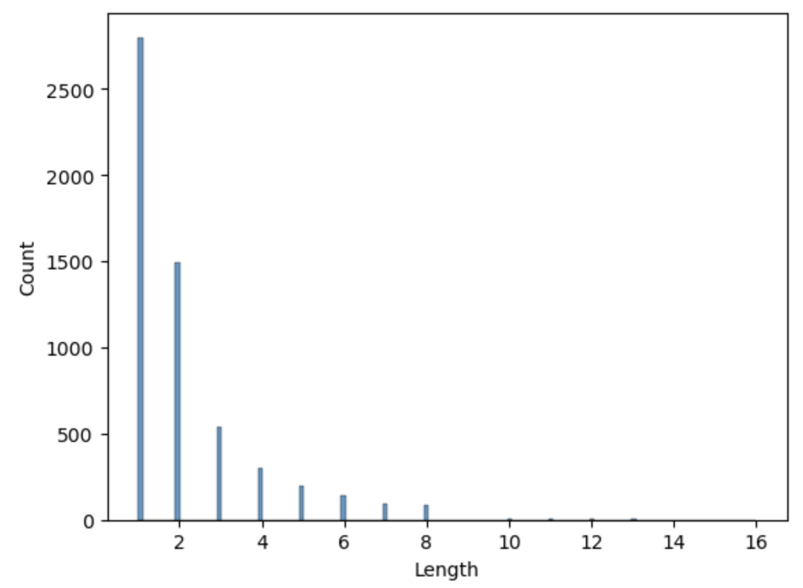
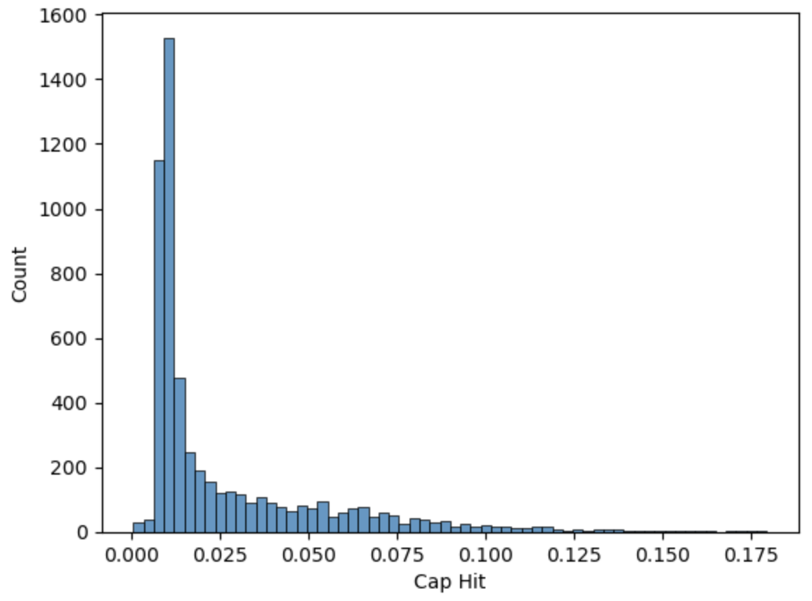
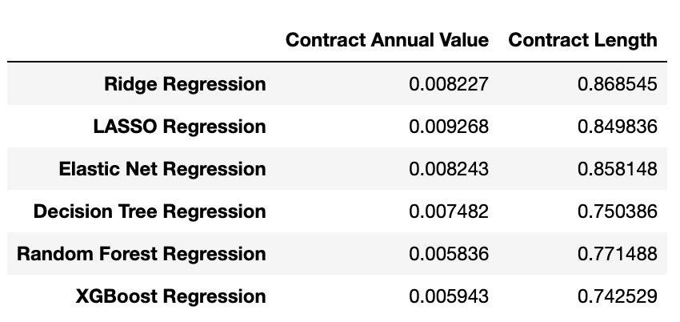
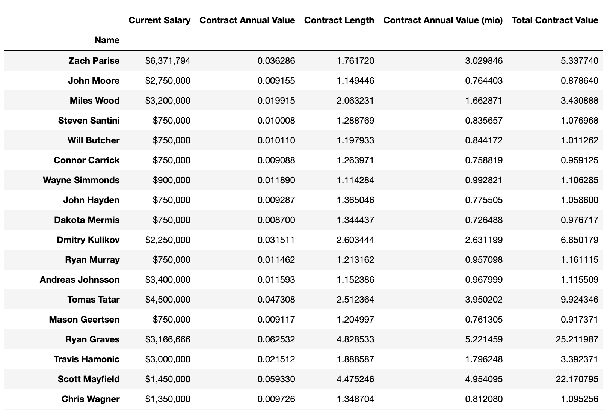

# NHL Contract Modeling

## Introduction

**Author**: Amelia Dobronyi  
**Pace**: Flex  
**Instructor**: Abhineet Kulkarni  

## Overview

This project builds a model to predict NHL contract values, via modeling the two components of the contract: the annual value and the length of the contract. The notebook [data_scrape.ipynb](https://github.com/adobronyi/predicting_movie_recommendations/blob/main/student_v1.ipynb) goes through the process of scraping the NHL API and other websites to obtain player and contract data for the purpose of training and testing the models; it also scrapes information on pending free agents. The notebook [model.ipynb](https://github.com/adobronyi/predicting_movie_recommendations/blob/main/presentation.pdf) goes through the EDA and modeling process, and deploys the final models to output the deliverable, which is a list of pending free agents and the model's predicted contract values. Finally, the [presentation](https://github.com/adobronyi/nhl_contract_models/blob/main/presentation.pdf) provides and overview of the business and technical aspects of the project.

Included in this repository is an environment file that can be used to replicate the environment in which the notebooks should be run. To do, run the following line in terminal upon downloading the environment file:

'conda env create -f environment.yml'

The environment must then be activated to proceed.

## Business Understanding

Most modern professional sports teams are governed by league rules whereby they can sign athletes to contracts under certain constraints. Depending on the sport and league rules, players, perhaps with the help of agents, can arrange for a payout over a given number of years. With the vast increase in statistical data for sports, there has been more publicity surrounding these contract signings and the seemingly ever-increasing payouts these athletes receive. For this project, we will examine how player data and statistics, specifically in professional hockey, influence the value of a contract free agents end up signing.

While the proposed 'fair value' of a contract is useful for both teams and players to know, it is arguably more important for teams to be anchored to this fundamental value. Players and their agents can and should always seek to get the highest value for themselves; but teams are tasked with constructing the best roster given their constraints, and knowing what a player should be paid and not overpaying for a player in particular are essential for building the best team. 

## Data Understanding

The data set consists of approximately 5500 NHL contracts that have been signed since 2006, which is the onset of the hard salary cap era. The final model predicts contract annual values and lengths for approximately 150 pending free agents. 

The distribution of the dependent variables show that most contracts signed are one to two years in length, and that the average annual contract value is about 2.5% of the salary cap, or about 2 million dollars with the current salary cap.

## Modeling

The modeling process for this project is twofold; because we are trying to predict the value of a player's contract, we need to separately model the annual cap hit of the contract, as well as the length of the contract. The annual dollar value (AAV) of the contract multiplied by the length of the contract gives the total contract value. 

First, the data needs to be further prepared for modeling. This involves splitting the data into training and test sets, encoding the categorical variables, and scaling the numeric variables. 

Second, for the model approaches used, cross-validation will be performed on the training set. We will use grid search with cross-validation to obtain the best parameters for each model tested.

Finally, a final model with the selected parameterization will be fitted on the full training set, and then run on the test set. The final model with the lowest mean average error on the test set will be selected as the final model and used for prediction on the new data. 

The choice of scoring metric is an important one in model selection, because choosing a model based on one metric or another might ultimately lead to a different set of predictions with new data. For regression-based error metrics, two typical choices are mean average error and root mean squared error. I have chosen mean average error as the preferred metric for two reasons:

1. the error term becomes directly interpretable; we are able to say that any predicted contract is on average off by some amount of yearly value and length, which gives the stakeholders a direct intuition for the usefulness of the model.
2. without a bias towards a certain kind of error distribution - for example, we cannot say with certainty that being off by a lot on a single contract is worse than being off by a lesser amount on multiple - the mean average error becomes the more conservative choice of metric.

Here is a summary of the models tested and their error terms:

## Deployment

Based on MAE, the chosen error metric, the models used should be random forest regression for predicting annual contract value, and XGBoost regression for predicting contract length. It is worth noting that with even a small change in data, or perhaps even further optimization, the model selection could end up being different; however, for the sake of ease, we will select the final model solely on the basis of MAE.

The deliverable for the project is a table showing current free agents and their suggested annual contract values and contract lengths, from which a subset is below:

## Conclusions and Future Improvements

On an absolute basis, we can conclude that the model predicts contract values pretty well, while it struggles more with contract length. This is not altogether unexpected, because contract length may ultimately be a better function of different features, which gives room to improve the project. In particular, player health metrics, injury history, and reputation / franchise value might be useful to incorporate in future versions of the model, and those features might be better predictors of the length of a contract a player ultimately signs.

In terms of contract value, out-of-sample MAE of about 0.005 is a strong result in terms of what it actually represents - to think that the model is off by less than 1% of the salary cap suggests that the contract market can indeed be very efficient, and suggests two further findings that can be tested:

* that the occurrence of so-called 'bad contracts' come down to contract length rather than contract value
* there is further room for teams to improve their analysis on the contracts they issue and further optimize

As for the project on the whole, there are a few more improvements to be had, in addition to improving the features used. Those would be:

* increasing the number of player statistics tested, as well as the granularity of those statistics (looking at the game level rather than the season level, for example)
* testing more unsupervised learning models, particularly neural networks
* expanding the analysis to goalies, which were not used in this project because they require a different set of statistics

## Repository structure

- technical notebooks: model.ipynb, data_scrape.ipynb
- figures folder
- data folder: data_ng.csv, new_contract_players.csv
- README.md
- presentation.pdf
- .gitignore
- environment.yml
